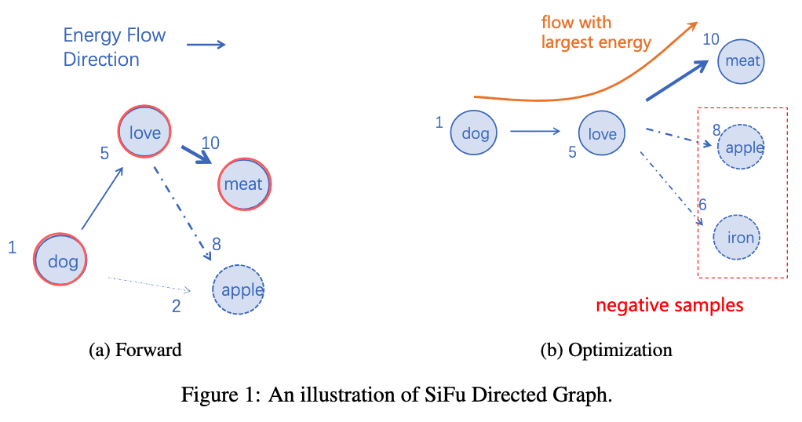
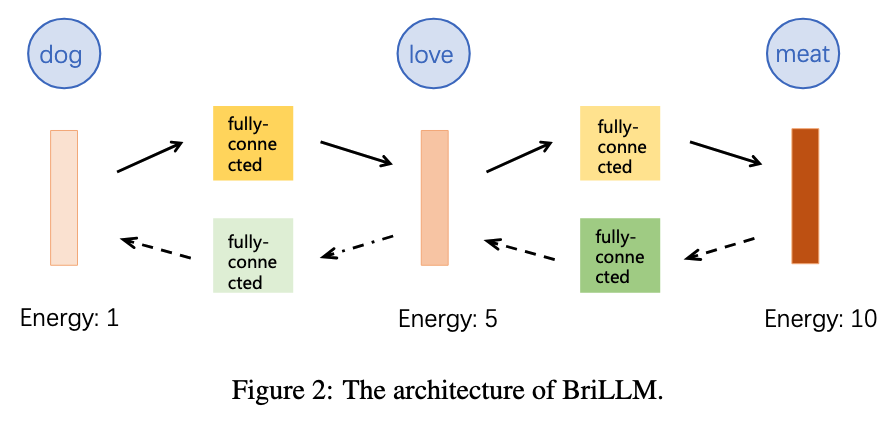

# BriLLM: Brain-inspired Large Language Model

## Overview
This work introduces the first brain-inspired large language model (BriLLM). This is a non-Transformer, non-GPT, non-traditional machine learning input-output controlled generative language model. The model is based on the Signal Fully-connected flowing (SiFu) definition on the directed graph in terms of the neural network, and has the interpretability of all nodes on the graph of the whole model, instead of the traditional machine learning model that only has limited interpretability at the input and output ends. 


As shown in Figure 1, SiFu model is a graph composed of multiple nodes, which are sparsely activated and utilize tensors to transmit a nominal signal.
Each node (ideally, a layer of neurons) represents a certain concept or word, e.g., a noun, a verb, etc.
Each edge models the relationship between every node pair.
The signal is transmitted by the magnitude of the energy. The energy will be strengthened, i.e., maximized, if it is in the right route. Or, at least, the right path always keeps the maximal energy for the transmitted signal.
Each node is sequentially activated in terms of the maximized energy.
Route or path is determined in a competitive way, i.e., the next node will be activated only if the energy can be maximally delivered in this node.



As shown in Figure 2, BriLLM implements SiFu neural network for language modeling. 
Each token in the vocabulary is modeled as a node, which is defined by a hidden layer of neurons in the neural network.


## Installation
```bash
pip install torch
```


## Checkpoint
[BriLLM0.5](https://huggingface.co/BriLLM/BriLLM0.5)


## Inference
```python
import json
import torch
from model import BraLM, Vocab

with open("./vocab.json") as f:
        node_dict = json.load(f)
vocab = Vocab.from_node_dict(node_dict)

model = BraLM(hidden_size=32)
model.prepare_network(vocab)

state_dict_0, state_dict_1 = torch.load("model_0.bin", weights_only=True), torch.load("model_1.bin", weights_only=True)
merged_state_dict = {**state_dict_0, **state_dict_1}
model.load_state_dict(merged_state_dict)
model.to_device("cuda:0")

head = "《罗马》描述了"
max_token = 16 - len(head)

start = [vocab((head[i]+ '->' +head[i+1])) for i in range(len(head)-1)]
ret = model.decode(start, vocab, max_token)
decode_tuple_list = [vocab.decode(p) for p in ret]
decode_sentence = decode_tuple_list[0][0] + "".join([p[-1] for p in decode_tuple_list])

print(decode_sentence)
```
